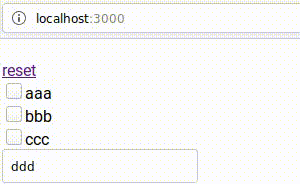

# react-url-sync
React hook for handling data in query param with specified types.



# Installation

```sh
npm install react-url-sync
```

# Examples

Example with `react-router-dom`<br />
https://codesandbox.io/s/condescending-leftpad-j58rb

Example with `react-router-dom` + `react-final-form`<br />
https://codesandbox.io/s/priceless-bhaskara-xu24e

Example with just `window`<br />
https://codesandbox.io/s/mutable-cloud-ww3rf

```js
// ...
import useUrlSync, { Type } from 'react-url-sync'

const Example = ({ history }) => {
  const [someData, setDomeData] = useState({
    page: 5,
    search: 'abc',
  })

  /*
    useUrlSync returns object
    from `onUpdate()` cast to specified `types`
  */
  const params = useUrlSync({
    /*
      passing `search` to callback like page=5&search=abc
      * prop is required
    */
    onHistoryReplace: (search) => history.replace(`/path?${search}`),
    /*
      'onUpdate()' is executed on every dependency change,
      should return current query params as object or
      string like page=4&search=def.
      * prop is required
    */
    onUpdate: () => someData,
    /*
      types should be object of Type params,
      * prop is NOT required
    */
    types: ({
      page: Type.Int,
      search: Type.String,
    }),
  }, [someData]) // dependencies

  // ...

  return (
    ...
  )
}

// For example could be used with react-router-dom
export default withRouter(Example)
```

- `Type` - library from https://www.npmjs.com/package/type-casting

# Building
```
npm run build
```
